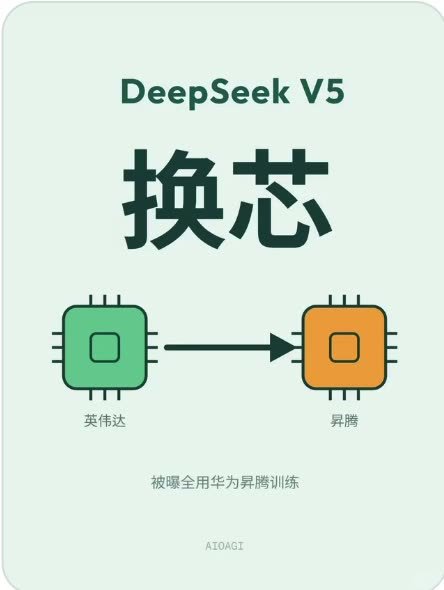

# RedNote NoBoost

> 把注意力留给值得看的笔记。

RedNote NoBoost 是一款面向**小红书网页版首页**的 Chrome 扩展原型。你手动开始扫描后，它会随着首页滚动读取新出现的笔记，结合标题、可获取的正文和**封面**上的文字，识别明显的商业推广或缺少信息量的情绪内容。只有判断足够明确时，它才会模糊卡片；你随时可以查看原内容。

**当前状态：V1 验证中。** 需要自行构建并在 Chrome 中加载，尚未发布到 Chrome Web Store。效果与网页结构、OCR 和 Jev 服务的可用性有关，请勿将判定当作对作者或内容质量的客观评价。

[了解功能](#它能做什么) · [安装试用](#本地安装) · [项目介绍页](site/index.html) · [离线滚动体验](site/experience.html) · [开发文档](docs/PROJECT-BASELINE.md)

## 先体验一下

[进入可滚动的离线体验页面](site/experience.html)：用真实小红书推荐流帖子封面与标题，体验滚动扫描、遮罩、查看原图和逐帖记录。**扫描结果、OCR 文本与遮罩均为预设演示**，不调用 Jev，也不代表对原帖的实际判断。

<a href="site/experience.html"></a> <a href="site/experience.html"></a> <a href="site/experience.html"></a>

素材截取于 2026-10-03 的公开推荐流画面，原帖版权归各自作者。体验页是产品交互样稿；实际扩展的效果需要在你的浏览器中运行。

## 它能做什么

- **两类过滤，分别开关。** 商业推广与情绪类内容可以独立启用。提到商品、表达负面情绪本身都不是过滤理由；项目尝试保留有事实、经验或具体方法的笔记。
- **只看封面，不截整页。** PP-OCRv6 Small 在浏览器本地识别封面文字；不扫描帖子后续图片，也不转写视频。首次使用需要联网下载模型。
- **结合正文判断。** 在不打开笔记的情况下，尝试读取页面缓存或后台补取当前首页笔记的正文；无法获取时会明确记录缺失，并采取保守处理。
- **可逆遮罩。** 命中的卡片仍在原位，可以查看原文；未判断、依据不足或发生错误的帖子保持可见。
- **看得见判断过程。** 扩展面板展示 OCR 健康状态、逐帖 OCR 结果、Jev 输入与输出、判断原因、扫描统计以及 Jev 用量和美元估算费用。

### 如何工作

```text
首页出现新笔记
     ↓
读取标题与可用正文 ── 本地 OCR 读取封面文字
     ↓
将可用文字交给 Jev 判断
     ↓
仅在明确命中且相应开关开启时模糊卡片
     ↓
可查看原文和本次页面会话的检测记录
```

封面图片由浏览器本地 OCR 处理；**标题、获取到的正文和 OCR 文字会发送至 TypeSafe/Jev**。逐帖历史只保留在当前页面会话，刷新或关闭页面后清空；累计调用次数与费用估算保存在浏览器本地。费用不是 Jev 账户余额。

## 本地安装

需要 **Chrome 116+**、**Node.js 20+** 和你自己的 **TypeSafe/Jev API Key**。

```sh
git clone https://github.com/pipiyapi/rednote-noboost.git
cd rednote-noboost
npm ci
npm run build
```

1. 打开 `chrome://extensions`，开启“开发者模式”。
2. 点击“加载已解压的扩展程序”，选择仓库中的 **`extension/` 文件夹**。
3. 打开扩展面板，进入 API 设置，保存自己的 Jev API Key。
4. 打开小红书网页版首页，等待面板里的 OCR 状态变为绿色“健康”，再点击“开始扫描”。

更新代码后重新运行 `npm ci` 和 `npm run build`，在扩展管理页重新加载扩展，**然后刷新小红书页面**。构建产物不提交到 Git，直接下载源码后也必须先构建。

## 使用范围与边界

- 目前只针对**桌面 Chrome 的小红书网页版首页推荐流**；不支持小红书手机 App，也不主动过滤搜索、详情、用户主页或评论区。
- 扫描默认暂停；只有手动开始后才会调用 Jev。OCR 显示“健康”只证明本地识别可用，不保证 API Key、额度或服务正常。
- 不自动打开笔记，不点赞、评论、关注、收藏或发布内容。
- 若无法获取足够材料、模型答案不明确或调用失败，帖子保持可见。网页结构改变可能影响采集能力。
- 页面中展示的过滤理由是规则命中项和阈值，不是模型自由生成的评价；误判与漏判仍需更多真实样本验证。
- 未登录状态能看到部分推荐流，但小红书可能在扫描期间要求登录。2026-10-03 的未登录实测中，扩展已发现笔记、OCR 显示健康，随后网页跳转登录页；本项目不会绕过站点限制。

## 开发与项目页面

- [可滚动的项目介绍页](site/index.html)与[离线体验页](site/experience.html)：静态 HTML/CSS/JS，无需额外构建。可在仓库根目录运行 `python3 -m http.server 8000`，然后访问 `http://localhost:8000/site/` 预览。页面使用真实帖子封面；体验判断预设，无实时 Jev 请求。介绍页仍提供适合后续制作讲解素材的展示模式，页面本身不嵌入视频。
- [V1 产品与开发基线](docs/PROJECT-BASELINE.md)：原根目录 README 已完整移入此处，保留原有决策和验收约定。
- [开发与测试说明](docs/DEVELOPMENT.md) · [技术决策](docs/DECISIONS.md) · [正文接入说明](docs/BODY-INTEGRATION.md) · [OCR 选型报告](docs/OCR-COMPARISON.md)

本项目是独立的个人实验项目，与小红书、TypeSafe 或 PaddleOCR 官方没有隶属关系。仓库目前没有声明开源许可证；如需复用代码，请先联系仓库所有者。
